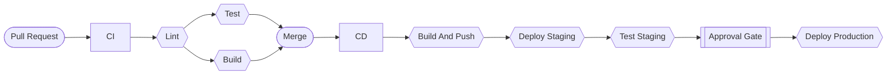

# Overview
Main focus of this project was to practice CI/CD Workflows for the application.  
Application is dockerized and uses tagging based on commit sha.

**This project contains:**
- Flask api application: Simple api for storing tasks (title, description)  
- Pytest tests for checking api endpoints

**The Project uses 3 workflows:**
- CI: Runs on every Pull Request to main (Lint, Test, Build)  
- CD: Runs after push to main (Build + Push, Deploy Staging, Run Tests, Deploy Production)
- Manual Deploy: Deploys specific image to Production/Staging (workflow_dispatch)

**Additional Protections:**  
- Approval Gate: Deploy on production environment needs manual approval
- Branch Protection: main branch is protected with rules
  - no direct push to main
  - base branch needs to be up to date with main
  - CI workflow needs to pass
 
# Architecture Diagram:

  
# Pipeline Description  
**CI:**
- Validates PR branch before merge
- Runs When Pull Request to main is created
- Jobs:
  - Lint: Runs Lint (flake8)
  - Test: Placeholder for future Unit Tests
  - Build: Builds Docker Image (No Push)

**CD:**
- Goal: Build and Deploy application to Production
- Runs When PR is pushed to main
- Jobs:
  - Build and Push: Builds image and pushes to ghcr. tags with :latest and :sha
  - Deploy Staging: Deploys image to Staging Environment
  - Tests: Runs Pytest tests against Staging Environment
  - Deploy Production: Requires manual approval, Deploys application to Production environment  

**CD - Manual:**
- Goal: Safety net for fast deployment
- Runs on workflow_dispatch
- Inputs:
  - image-tag: Tag of image to be deployed
  - environment: staging/production
- Jobs:
  - Deploy: Deploys image with tag from input on specified environment.
